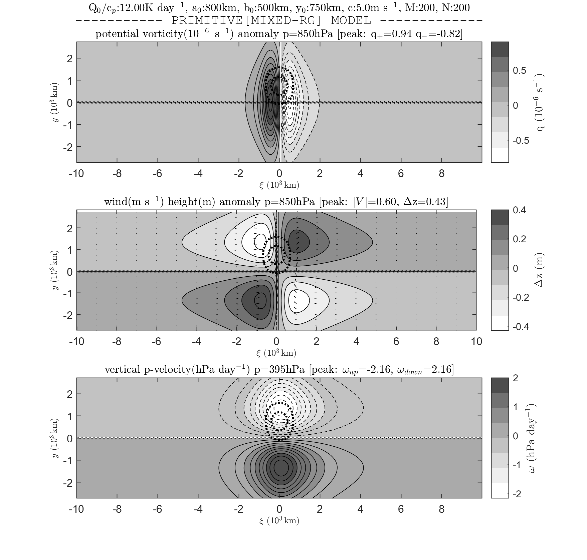

# MJO Equatorial Wave Model

The **Madden-Julian oscillation (MJO)** is a tropical weather phenomena which originate in the Indian Ocean and propagates eastward along the
Equator until dying out near the dateline in the colder waters of the eastern Pacific.  The MJO is made up a large-scale convective envelope
moving eastward near the equator accompanied by the equatorial wave response to the translating heat source.  The total wave response is a sum
of the individual wave components: _Eastward and Westward Inertio-gravity_ waves, _Kelvin_ wave, _Mixed-Rossby gravity_ wave, and _Rossby_ wave.  The
Rossby wave response is found to the West of the convective cluster and the Kelvin wave response to East of the cluster.  The research done
with the model contained in this repository looks at the MJO as a composition of these equatorial wave components and then investigates the
degree to which it's dynamics can be captured from it's **potential vorticity (PV) principle**.  

The model contained in the repository is a suite of MatLab scripts which simulate the response fields based on a parameterized convective heat-source.  The
parameters that control the characteristics of the cloud cluster are found in the file, `MJO_PARAMS.m`, located in the root directory.  Once the heating source has
been prescribed, the model can be run by calling the main run script, `MJO_RUN.m`.  The run script first runs the simulation, then calls the last script located in the
root directory, `MJO_PLOT.m`, which generates a 3-panel plot of the response field.  The top panel displays the PV field, the middle panel contains the wind and height
fields, and the bottom panel shows the vertical (pressure) velocity field.  When calling the `MJO_RUN.m` script you will be prompted to run either the total equatorial
wave response, or to run a particular wave component.

Assuming MatLab is installed on your machine, to run the model with default cloud cluster forcing simply download the the repository and then run the main script in
the root directory, `MJO_RUN.m`.  The `README.md` contains further information on settings found in `MJO_PARAMS.m` and `MJO_PLOT.m`.  Additionally it contains model 
background information as well as references that are related to it.  Below shows a sample output plot of the Mixed-Rossby gravity wave response to a cloud cluster (see 
dashed oval) centered 750km north of the equator.
 

 
